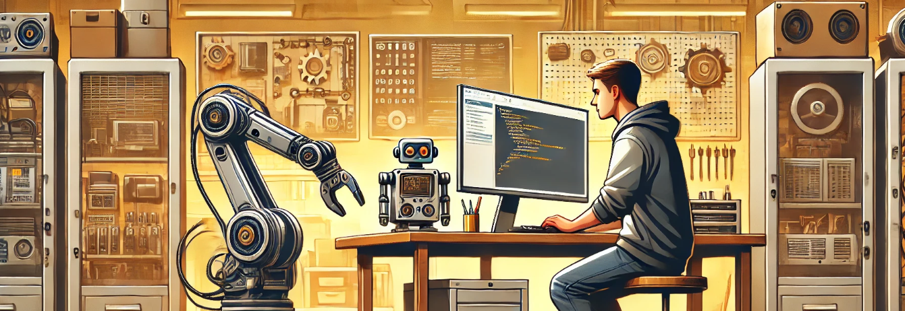
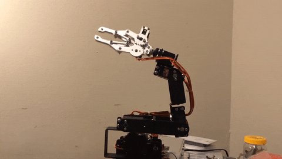

# Robotics Engineer - Industrial and Mobile Robotics!

**`Currently working at ABB, Madrid - Backend Robotics `**

### About me 
I'm a robotics engineer with a passion for innovation and the transformative power of automation. I’m deeply invested in exploring Machine Learning's potential in robotics to create adaptive, intelligent systems that push boundaries. Striving for excellence in every project, I aim to build solutions that enhance human capabilities and contribute to a smarter, more sustainable future.

- 👨‍💻 I’m currently working on F1Tenth Autonomous Racing Systems 🏎️.
- 📚 I’m currently learning Deep Reinforcement Learning for Robotics!
-  I'm currently learning German!
- 💪🏼 Future Goals: Learn more technologies - Never stop creating new ideas.

### 🧰 Languages and Tools

 

### 🌐 Robotics Simulators

### 📇 Contact me!

